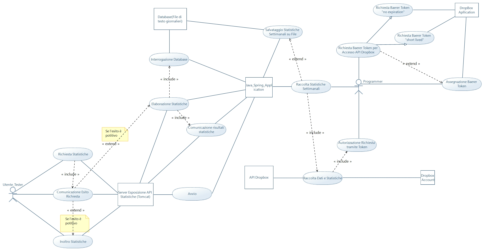
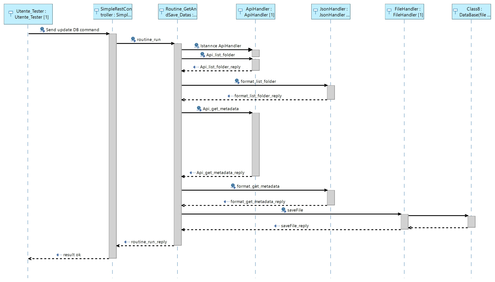
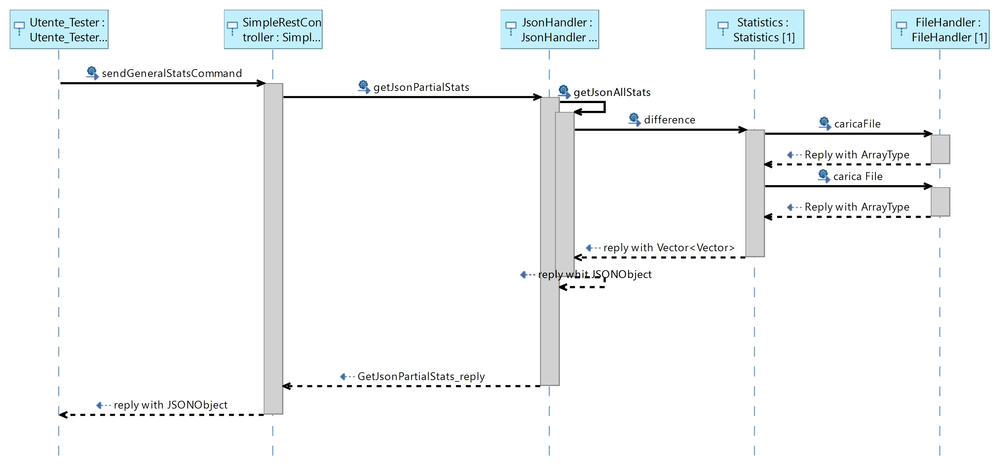

# ProgettoEsameOOP_Agostinelli-Monaco
Repository dedita al progetto d'esame di Object Oriented Programming a.a. 2020/2021

## Target

Questo progetto si pone l'obiettivo della creazione di una applicazione Java volta ad interfacciarsi con le API di Dropbox al fine di poter raccogliere informazioni sui metadati del contenuto di uno specifico account Dropbox. Attraverso la raccolta di tali informazioni lo scopo dell'applicazione si manifesta nell'elaborare statistiche settimanali riguardanti utilizzo medio di file e cartelle: generazione, modifica, cancellazione di file/cartelle nella settimana scelta. Viene offerta inoltre la  possibilità di filtraggio in base a dimensione e/o tipologia di file con facoltà di scegliere la finestra temporale in cui generare le statistiche.

## Titolo

 - L'applicazione sviluppata, per poter elaborare le sopracitate
   statistiche necessita di un "database". Per semplicità si è deciso di
   utilizzare una collezione di file di testo per memorizzare le
   informazioni dei metadati, mediante il loro incapsulamento in un
   apposito oggetto serializzato. I file di testo sono nominati con la
   data di raccolta delle informazioni (yyyymmgg.txt).
 - L'applicazione si occupa di raccogliere informazioni attraverso l'invio di 2 diversi tipi di richiesta POST api esposta da una applicazione Dropbox:
	 - **/list_folder**: per ricevere informazioni riguardo il contenuto di una cartella e del relativo sotto-contenuto.
	 La richiesta prevede un body di tipo json dalla seguente struttura:
		```json
		 {
			"path": "/Homework/math",
		    "recursive": true,
		    "include_media_info": false,
		    "include_deleted": true,
		    "include_has_explicit_shared_members": false,
		    "include_mounted_folders": true,
		    "include_non_downloadable_files": true
		}
		```
		 mentre la risposta, sempre in json ha la seguente struttura:
		 ```json
		  {
            ".tag": "file",
            "name": "Prime_Numbers.txt",
            "id": "id:a4ayc_80_OEAAAAAAAAAXw",
            "client_modified": "2015-05-12T15:50:38Z",
            "server_modified": "2015-05-12T15:50:38Z",
            "rev": "a1c10ce0dd78",
            "size": 7212,
            "path_lower": "/homework/math/prime_numbers.txt",
            "path_display": "/Homework/math/Prime_Numbers.txt",
            "sharing_info": {
                "read_only": true,
                "parent_shared_folder_id": "84528192421",
                "modified_by": "dbid:AAH4f99T0taONIb-OurWxbNQ6ywGRopQngc"
            },
            "is_downloadable": true,
            "property_groups": [
                {
                    "template_id": "ptid:1a5n2i6d3OYEAAAAAAAAAYa",
                    "fields": [
                        {
                            "name": "Security Policy",
                            "value": "Confidential"
                        }
                    ]
                }
            ],
            "has_explicit_shared_members": false,
            "content_hash": "e3b0c44298fc1c149afbf4c8996fb92427ae41e4649b934ca495991b7852b855",
            "file_lock_info": {
                "is_lockholder": true,
                "lockholder_name": "Imaginary User",
                "created": "2015-05-12T15:50:38Z"
            }
        }
		```
	 - **/get_metadata**: per ricevere tutti i metadati di uno specifico file
		La richiesta prevede un body di tipo json dalla seguente struttura:
		```json
		{
		    "path": "/Homework/math",
		    "include_media_info": true,
		    "include_deleted": true,
		    "include_has_explicit_shared_members": false
		}
		```
		 mentre la risposta, sempre in json ha la seguente struttura:
		```json
		{
		    ".tag": "file",
		    "name": "Prime_Numbers.txt",
		    "id": "id:a4ayc_80_OEAAAAAAAAAXw",
		    "client_modified": "2015-05-12T15:50:38Z",
		    "server_modified": "2015-05-12T15:50:38Z",
		    "rev": "a1c10ce0dd78",
		    "size": 7212,
		    "path_lower": "/homework/math/prime_numbers.txt",
		    "path_display": "/Homework/math/Prime_Numbers.txt",
		    "sharing_info": {
		        "read_only": true,
		        "parent_shared_folder_id": "84528192421",
		        "modified_by": "dbid:AAH4f99T0taONIb-OurWxbNQ6ywGRopQngc"
		    },
		    "is_downloadable": true,
		    "property_groups": [
		        {
		            "template_id": "ptid:1a5n2i6d3OYEAAAAAAAAAYa",
		            "fields": [
		                {
		                    "name": "Security Policy",
		                    "value": "Confidential"
		                }
		            ]
		        }
		    ],
		    "has_explicit_shared_members": false,
		    "content_hash": "e3b0c44298fc1c149afbf4c8996fb92427ae41e4649b934ca495991b7852b855",
		    "file_lock_info": {
		        "is_lockholder": true,
		        "lockholder_name": "Imaginary User",
		        "created": "2015-05-12T15:50:38Z"
		    }
		}
		```
		**nota bene:** per utilizzare le api esposte da dropbox è necessario creare una applicazione dropbox che sia in grado di esporle, e questa necessita di un token di accesso. Senza il token non è possibile accedere alle api di Dropbox.
	A tal proposito è presente un file Config.txt che contiene la stringa del token, in maniera tale che questo sia modificabile dall'utente nel caso in cui per varie ragioni il token cambi valore (per es. se fosse un token short-lived)

## Diagrammi uml

 - Class Diagram

	</img>

 - Use Case Diagram
  
  </img>
	
 - Sequence Diagram
  

	 - -update database
	</img>
	 - -statistiche generali
	   </img>
	 - search by name
	</img>

## Rotte applicazione
Attraverso l'applicativo Postman è possibile interrogare le api della nostra applicazione, mediante delle richieste POST o GET che si descrivono in seguito:

 - update database

http://localhost:8080/updateDatabase
result
{"result":"ok"}
oppure

 - general Stats

http://localhost:8080/generalStats?date1=20201228&date2=20201229
body
{
    "type1":""
    "type2":""
    "file1Extention":""
    "file2Extention":""
    "sizeMin":""
    "sizeMax":""
}
result
{
    "Modified File": [
        {
            "path": "/Cartella modificata 3.2/SD_WII/installer.log",
            "size": 11271,
            "name": "installer.log",
            "id": "id:gMZ7dl8JdiEAAAAAAAAz3g",
            "type": "File",
            "last modify": "20201229",
            "revision": "5b79a6938b4280cec7070"
        }
    ],
    "New File": [
        {
            "path": "/Cartella modificata 3.2/SD_WII/boot.elf",
            "size": 2153056,
            "name": "boot.elf",
            "id": "id:gMZ7dl8JdiEAAAAAAAAz3Q",
            "type": "File",
            "last modify": "20201229",
            "revision": "5b79a6938b4270cec7070"
        }
    ],
    "Deleted": [
        {
            "path": "/Cartella modificata 3.2/linux2.0.txt",
            "name": "linux2.0.txt",
            "type": "deleted"
        }
    ],
    "Folder": [
        {
            "path": "/Cartella modificata 3.2/WBFS Manager 4.0/Channels/WiiCrazy15",
            "name": "WiiCrazy15",
            "id": "id:gMZ7dl8JdiEAAAAAAAA1HQ",
            "type": "Folder"
        }
    ],
    "error": false
}

 - test

http://localhost:8080/test
result
{
    "path": "path",
    "size": 102030,
    "name": "name",
    "id": "id",
    "type": "tag",
    "last modify": "20201218",
    "revision": "xtcfgvjbhk"
}

 - seach by name

http://localhost:8080/searchByName?object=1_Introduzione.pdf&date=20201228
result
{
    "error": false,
    "info": [
        {
            "path": "/Condivisi/Pera/univerista'/3 anno/Sistemi elettronici/Dispense/01_Introduzione.pdf",
            "name": "01_Introduzione.pdf",
            "type": "deleted"
        },
        {
            "path": "/univerista'/3 anno/Sistemi elettronici/Dispense/01_Introduzione.pdf",
            "size": 1460137,
            "name": "01_Introduzione.pdf",
            "id": "id:gMZ7dl8JdiEAAAAAAAAbYg",
            "type": "File",
            "last modify": "20200603",
            "revision": "5a72d6416dabb0cec7070"
        },
    ]
}


  ## Get starded
 - avviare Eclipse
 - lanciare l'applicazione "Progetto_EsameOOP_AgostinelliMonaco" **come Spring Apllication**
 - avviare Postman
 - 

	